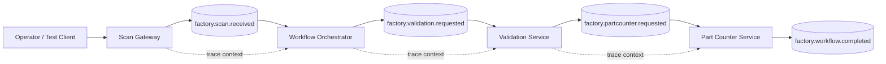
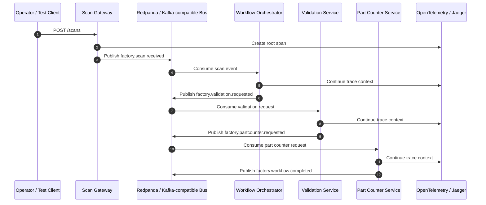

# FactoryFlow Demo

FactoryFlow is a public, sanitized demo that demonstrates event-driven workflow orchestration patterns for industrial manufacturing systems.

This repository is intentionally generic. It does **not** contain company source code, internal architecture, production data, customer information, real station names, or proprietary business logic.

## What this demo shows

- Event-driven manufacturing workflow orchestration
- Scan gateway pattern
- Workflow orchestrator pattern
- Validation service pattern
- Part counter service pattern
- Correlation ID propagation
- OpenTelemetry tracing across services
- Redis-backed idempotency and lightweight state
- Kafka/Redpanda as the event backbone

## Architecture



## Event flow



## Repository structure

```text
factoryflow-demo/
├── docker-compose.yml
├── docs/
│   ├── architecture.md
│   ├── design-decisions.md
│   ├── event-schema.md
│   └── tracing.md
├── services/
│   ├── scan-gateway/
│   ├── workflow-orchestrator/
│   ├── validation-service/
│   └── part-counter/
└── shared/
    ├── factoryflow/
    │   ├── events.py
    │   ├── messaging.py
    │   └── tracing.py
    └── pyproject.toml
```

## Intended MVP flow

1. A user submits a synthetic serial scan to the Scan Gateway.
2. The Scan Gateway publishes a `factory.scan.received` event.
3. The Workflow Orchestrator injects or selects a workflow.
4. The Validation Service validates the scan using simple demo rules.
5. The Part Counter increments a synthetic production counter.
6. The workflow completes and can be traced end-to-end in Jaeger.

## Design notes

For architecture rationale and trade-offs, see [Design Decisions](docs/design-decisions.md).

## Local development target

This repo is starting with a lightweight skeleton. The first runnable milestone is:

```bash
docker compose up --build
```

Then submit a scan:

```bash
curl -X POST http://localhost:8000/scans \
  -H "Content-Type: application/json" \
  -d '{"serial":"DEMO-001","station":"ASSEMBLY-01","operator":"demo-user"}'
```

## Safety boundary

This project is a clean-room demonstration of general architecture patterns. It avoids:

- real production payloads
- internal topic names
- real customer or plant identifiers
- private process logic
- internal network or security details
- company-specific system names

## License

MIT License is recommended for this demo, but choose the final license deliberately before accepting external contributions.
